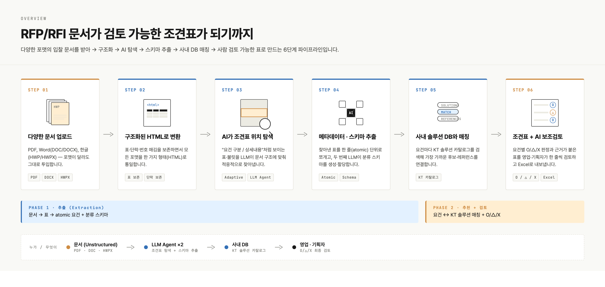
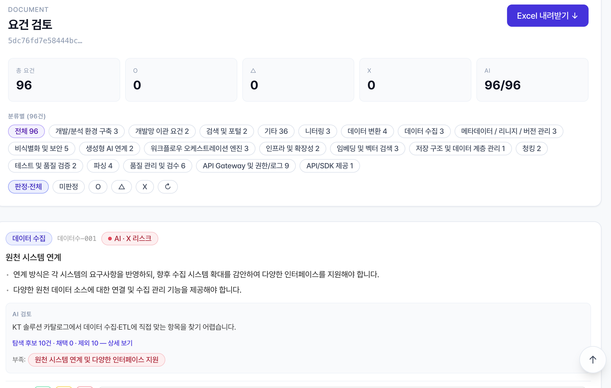
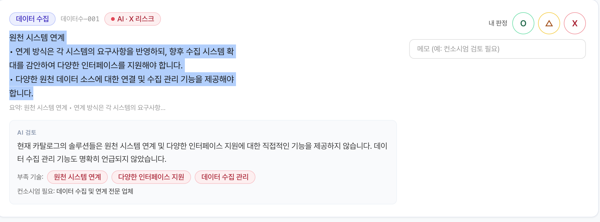
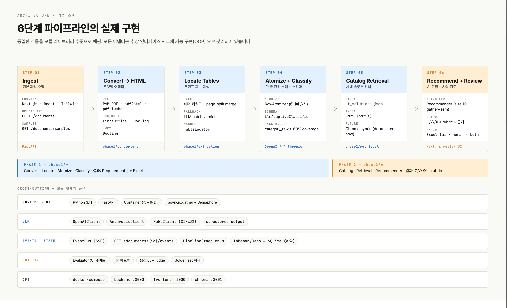

# rfp-matcher

RFP/RFI **비정형 문서**(PDF · DOC/DOCX · HWPX)에서 조견표를 **atomic 단위**로 자동 추출하고,  
KT AI 솔루션 카탈로그를 근거로 **요건별 리스크(O/△/X) 추천**을 붙여 영업·기획 검토를 가속하는 2-phase 시스템입니다.

> **중요:** 이 프로젝트는 특정 RFP(예: 하나은행) 전용 도구가 **아닙니다**.  
> 하나.pdf는 PoC 검증용 샘플일 뿐이며, 목표는 **문서 포맷·표 레이아웃·분류 체계가 달라도 동작하는 범용(holistic) RFP 분석 파이프라인**입니다.

---

## 목차

- [시각 자료 (assets)](#시각-자료-assets)
- [기술 스택](#기술-스택)
- [현재 상태](#현재-상태)
- [시스템 개요](#시스템-개요)
- [전체 시스템 시연 (데모)](#전체-시스템-시연-데모)
- [디렉터리 구조](#디렉터리-구조)
- [빠른 실행 (로컬)](#빠른-실행-로컬)
- [환경 변수](#환경-변수)
- [파이프라인 상세](#파이프라인-상세)
- [API 개요](#api-개요)
- [아키텍처 원칙](#아키텍처-원칙)
- [평가(Evaluator)](#평가evaluator)
- [Docker](#docker)
- [로드맵 / TODO](#로드맵--todo)
- [마일스톤](#마일스톤)
- [Git에 올리는 방법](#git에-올리는-방법)

---

## 시각 자료 (assets)

저장소 `assets/` 폴더에 워크플로·UI·상세 화면 스크린샷을 포함합니다. 아래는 README 미리보기용입니다.

### End-to-end 워크플로



업로드 → HTML 변환 → 조견표 탐지 → atomic 분해 → 분류 → AI 추천 → 웹 리뷰 → Excel export 까지의 전체 흐름입니다.

### 웹 UI (리뷰 화면)



요건을 한 줄씩 표시하고, O/△/X 판정·AI 근거·Excel export를 같은 화면에서 처리합니다.

### 시연 스크린샷



샘플 RFP(`하나.pdf` 등) 처리 후 조견표·AI 추천이 채워진 상태 예시입니다.

### 상세 화면 · 컴포넌트



파이프라인 진행 상태, 카탈로그 매칭 감사(`CatalogAuditPanel`), Export 옵션 등 세부 UI입니다.

---

## 기술 스택

| 영역 | 기술 |
|------|------|
| **Backend** | Python 3.11+, FastAPI, Uvicorn, Pydantic v2 |
| **문서 변환** | PyMuPDF (기본 PDF), LibreOffice (DOC/HWPX), pdf2html·Docling (옵션) |
| **추출·분류** | BeautifulSoup/lxml, 휴리스틱 + OpenAI/Anthropic structured output |
| **검색·추천** | BM25 (`bm25s`), KT 카탈로그 JSON, 배치 LLM rubric |
| **Frontend** | Next.js 16 (App Router), React 18, Tailwind CSS, SWR |
| **실시간** | SSE (`sse-starlette`) — 파이프라인 진행·동시 편집 이벤트 |
| **평가·CI** | pytest, evaluator 룰 메트릭 + 옵션 LLM judge |
| **인프라** | Docker Compose (backend + frontend + Chroma) |

---

## 현재 상태

| 항목 | 상태 | 비고 |
|------|------|------|
| PDF/DOC/HWPX → HTML 변환 | ✅ 동작 | 기본 PDF 엔진: PyMuPDF |
| 조견표 탐지 + atomic 분해 | ✅ 동작 | 하나.pdf 기준 13개 표 → 96 atomic |
| Adaptive 분류 (LLM 스키마 생성) | ⚠️ PoC | `LlmAdaptiveClassifier` — 룰 기반, 정교화 필요 |
| 웹 리뷰 UI + O/△/X 편집 | ✅ 동작 | Next.js App Router |
| Excel 3종 export (AI/사람/둘 다) | ✅ 동작 | |
| KT 카탈로그 + BM25 검색 | ⚠️ PoC | 합성 시드 ~40건, 실 DB 고도화 필요 |
| AI 추천 (배치 LLM + rubric) | ✅ 동작 | OpenAI/Anthropic 또는 `fake` |
| Evaluator (CI 게이트) | ✅ 동작 | 룰 메트릭 + 옵션 LLM judge |
| **범용 RFP 대응** | 🚧 진행 중 | 특정 문서에 overfit 방지가 핵심 과제 |

**PoC 검증 샘플 (`data/raw/`, gitignore):**

| 파일 | 기관 | 비고 |
|------|------|------|
| `하나.pdf` / `하나.doc` | 하나은행 | 비정형 AI 플랫폼 — end-to-end 기준 문서 |
| `(삼성카드) 제안요청서.pdf` | 삼성카드 | 제안요청서 |
| `(신한라이프) AX HUB 구축_제안요청서.pdf.pdf` | 신한라이프 | AX HUB 구축 |
| `(JB 금융그룹) 붙임2. 제안요청서(안).pdf` | JB금융 | 제안요청서(안) |
| `법제처_…RFI_*.hwpx` | 법제처 | HWPX 포맷 검증 |

홈 화면 **「샘플로 시연」** 목록·표시명은 `data/samples.manifest.json` 에서 관리합니다 (raw 파일 없어도 manifest는 커밋).

---

## 시스템 개요

```
┌─────────────────────────────────────────────────────────────────────────┐
│  Phase 1 — 조견표 추출                                                    │
│  업로드 → HTML 변환 → 조견표 탐지 → atomic 분해 → 분류 → Excel/웹 리뷰    │
└─────────────────────────────────────────────────────────────────────────┘
                                    │
                                    ▼
┌─────────────────────────────────────────────────────────────────────────┐
│  Phase 2 — AI 추천                                                        │
│  BM25 카탈로그 검색 → LLM 배치 검증 → O/△/X + 근거 + rubric              │
└─────────────────────────────────────────────────────────────────────────┘
```

**사용 흐름**

1. `http://localhost:3000` 에서 PDF/DOC/HWPX 업로드 (또는 `data/raw` 샘플 선택)
2. SSE로 파이프라인 진행률 실시간 확인 (`/documents/{doc_id}/events`)
3. `/review/{docId}` 에서 요건 한 줄씩 검토, O/△/X 인라인 편집
4. 우상단 Export 패널에서 **AI만 / 사람만 / 둘 다** Excel 다운로드

---

## 전체 시스템 시연 (데모)

아래는 **백엔드 + 프론트엔드**를 동시에 띄워 end-to-end를 재현하는 절차입니다.  
터미널을 **2개** 열어 진행하세요.

### 0) 최초 1회 — 의존성·설정

```bash
# 프로젝트 루트
cd rfp-matcher

cp config/.env.example config/.env
# config/.env 에 OPENAI_API_KEY=sk-... 입력 (또는 아래 fake 모드)

# 백엔드
cd backend
python3 -m venv .venv && source .venv/bin/activate
pip install -e ".[dev]"

# KT 카탈로그 시드 (최초 1회)
python -m app.phase2.crawler.kt_catalog_scraper --seed \
       --out ../data/catalog/kt_solutions.json

# 프론트엔드
cd ../frontend
npm install
```

**샘플 RFP** — `data/raw/` 에 테스트 파일을 넣습니다 (gitignore, 로컬 전용).

```bash
# 예: 하나.pdf 가 이미 있다면 생략
mkdir -p data/raw
# data/raw/하나.pdf, data/raw/법제처_*.hwpx 등
```

### 1) 터미널 A — 백엔드 (포트 8000)

```bash
cd rfp-matcher/backend
source .venv/bin/activate

# 실제 LLM (OpenAI) — AI 추천까지 풀 데모
PYTHONPATH=. LLM_PROVIDER=openai uvicorn app.main:app --reload --port 8000

# 또는 API 키 없이 UI·추출만 (AI는 더미 응답)
# PYTHONPATH=. LLM_PROVIDER=fake uvicorn app.main:app --reload --port 8000
```

기동 확인:

```bash
curl -s http://localhost:8000/healthz
# → {"status":"ok"} 형태
```

### 2) 터미널 B — 프론트엔드 (포트 3000)

```bash
cd rfp-matcher/frontend
npm run dev
# → http://localhost:3000
```

Next.js가 `/api/*` 요청을 `http://localhost:8000` 으로 프록시합니다 (`next.config.mjs`).

### 3) 브라우저 시연 시나리오

1. **http://localhost:3000** 접속
2. **「샘플로 시연」** 에서 `하나` (PDF) 클릭 — 또는 **파일 업로드**
3. 자동으로 **http://localhost:3000/review/{docId}** 로 이동
4. 상단 **PipelineStatus** 에서 단계별 진행 확인 (약 1~2분: 추출 → AI 96건)
5. 조견표가 한 줄씩 나타나면 **O/△/X** 클릭해 사람 판정 입력
6. 우상단 **Export** → `AI만` / `사람만` / `둘 다` Excel 다운로드

> 추출이 끝나면 백엔드가 **AI 추천을 백그라운드로 자동 시작**합니다. 조견표가 먼저 보이고, 추천은 카드별로 순차 갱신됩니다.

### 4) CLI/API 데모 (curl — 백엔드만)

프론트 없이 API만 검증할 때:

```bash
# 샘플 목록
curl -s http://localhost:8000/documents/samples | python3 -m json.tool

# 샘플 하나.pdf 로 파이프라인 시작 → doc_id 수신
DOC=$(curl -s -X POST http://localhost:8000/documents/from-sample \
  -H "Content-Type: application/json" \
  -d '{"name":"하나.pdf"}' | python3 -c "import sys,json; print(json.load(sys.stdin)['doc_id'])")
echo "doc_id=$DOC"

# 파이프라인 상태 폴링 (READY_FOR_REVIEW / RECOMMENDED 까지)
watch -n 2 "curl -s http://localhost:8000/documents/$DOC/pipeline | python3 -m json.tool"

# 추출된 요건 수 확인
curl -s "http://localhost:8000/documents/$DOC/requirements" | python3 -c \
  "import sys,json; print('requirements:', len(json.load(sys.stdin)))"

# Excel 다운로드 (AI 판정 포함)
curl -s -o "demo_${DOC}_ai.xlsx" \
  "http://localhost:8000/documents/$DOC/export?mode=both"
open "demo_${DOC}_ai.xlsx"   # macOS
```

파일 직접 업로드:

```bash
curl -s -X POST http://localhost:8000/documents \
  -F "file=@data/raw/하나.pdf" | python3 -m json.tool
```

SSE 이벤트 스트림 (진행률 실시간):

```bash
curl -N "http://localhost:8000/documents/$DOC/events"
```

### 5) 백엔드 벤치마크 (추출 단계별 소요 시간)

```bash
cd rfp-matcher/backend
source .venv/bin/activate

# fake LLM — 변환·탐지·분해 속도만 측정
PYTHONPATH=. python scripts/benchmark_extraction.py ../data/raw/하나.pdf --llm fake

# OpenAI — 실제 LLM 포함 전체 측정
PYTHONPATH=. python scripts/benchmark_extraction.py ../data/raw/하나.pdf --llm openai
```

### 6) Docker로 한 번에 기동

```bash
cd rfp-matcher
docker compose up --build
# frontend http://localhost:3000  |  backend http://localhost:8000
```

### 7) 테스트·품질 게이트 (선택)

```bash
# 백엔드 단위·통합 테스트
cd backend && source .venv/bin/activate
PYTHONPATH=. LLM_PROVIDER=fake pytest -q

# Evaluator (CI 게이트)
cd .. && PYTHONPATH=backend LLM_PROVIDER=fake python evaluator/runner.py

# 프론트 lint / typecheck
cd frontend && npm run lint && npm run typecheck
```

### 데모 체크리스트

| 단계 | 기대 결과 | 확인 방법 |
|------|-----------|-----------|
| 헬스체크 | `200 OK` | `curl localhost:8000/healthz` |
| 샘플 목록 | `하나.pdf` 등 표시 | 홈 화면 또는 `/documents/samples` |
| HTML 변환 | 표 20+개, 단락 1000+ | 백엔드 로그 `CONVERTED` |
| 조견표 추출 | ~96줄 (하나.pdf) | 리뷰 화면 또는 `/requirements` |
| AI 추천 | 96/96 `RECOMMENDED` | PipelineStatus / SSE |
| Excel | xlsx 다운로드 | Export 패널 |

---

## 디렉터리 구조

```
rfp-matcher/
├── backend/                    # Python 3.11 + FastAPI
│   ├── app/
│   │   ├── api/                # REST + SSE 엔드포인트
│   │   ├── core/               # Settings, Container (싱글톤 DI)
│   │   ├── domain/             # Document, Requirement, PipelineStage 등
│   │   ├── llm/                # OpenAI / Anthropic / Fake 클라이언트
│   │   ├── phase1/             # 변환 · 탐지 · 분해 · 분류
│   │   │   ├── converters/     # PyMuPDF, pdf2html, Docling, LibreOffice
│   │   │   ├── extraction/     # TableLocator, RowAtomizer, Classifier
│   │   │   └── loaders/
│   │   ├── phase2/             # 카탈로그 · BM25 · Recommender
│   │   ├── services/           # Extraction, Recommendation, Pipeline
│   │   └── storage/            # InMemoryRepo (PoC), SQLite 경로 예약
│   ├── tests/
│   └── scripts/                # 벤치마크 스크립트
├── frontend/                   # Next.js + React + Tailwind
│   ├── app/                    # upload, review/[docId]
│   ├── components/             # RequirementRow, ExportPanel, PipelineStatus …
│   └── lib/                    # API 클라이언트, SSE 훅
├── evaluator/                  # 단계별 정합성 평가 (CI 게이트)
├── assets/                     # README용 스크린샷·워크플로 다이어그램 (git 포함)
├── config/
│   └── .env.example            # API 키 템플릿 (실제 .env는 gitignore)
├── data/                       # 런타임 데이터 (대부분 gitignore)
│   ├── raw/                    # 원본 RFP (민감 — 커밋 제외)
│   ├── processed/              # 산출 Excel
│   ├── catalog/                # kt_solutions.json, BM25 인덱스
│   ├── storage/                # 문서별 HTML·중간 산출물
│   └── vectorstore/            # Chroma (향후 확장용, 현재 BM25 우선)
└── docker-compose.yml
```

---

## 빠른 실행 (로컬)

> **풀 데모(2터미널 + 브라우저 + curl)** 는 [전체 시스템 시연 (데모)](#전체-시스템-시연-데모) 를 참고하세요.

### 사전 요구

- Python **3.11+**
- Node.js **18+**
- (선택) LibreOffice — DOC/HWPX 변환
- (선택) OpenJDK — `PDF_CONVERTER=pdf2html` 사용 시

### 1) 환경 설정

```bash
cp config/.env.example config/.env
# config/.env 에 OPENAI_API_KEY 또는 ANTHROPIC_API_KEY 입력
```

### 2) 백엔드

```bash
cd backend
python -m venv .venv && source .venv/bin/activate
pip install -e ".[dev]"

# KT 카탈로그 시드 생성 (크롤러 가동 전 PoC용, ~50건 합성)
python -m app.phase2.crawler.kt_catalog_scraper --seed \
       --out ../data/catalog/kt_solutions.json

# 서버 기동 (키 없이 테스트: LLM_PROVIDER=fake)
cd backend
PYTHONPATH=. LLM_PROVIDER=openai uvicorn app.main:app --reload --port 8000
```

| LLM 모드 | 설명 |
|----------|------|
| `openai` | GPT-4o 등 (기본) |
| `anthropic` | Claude |
| `fake` | 결정적 더미 응답 — CI·로컬 UI 테스트용 |

### 3) 프론트엔드

```bash
cd frontend
npm install
npm run dev
# → http://localhost:3000
```

### 4) 샘플 파일 준비

`data/raw/` 에 테스트 RFP를 넣으면 홈 화면 **「샘플로 시연」** 목록에 표시됩니다.  
(원본 RFP는 민감 정보일 수 있어 **git에 올리지 않습니다**.)

---

## 환경 변수

`config/.env` (또는 셸 export):

| 변수 | 기본값 | 설명 |
|------|--------|------|
| `OPENAI_API_KEY` | — | OpenAI API 키 |
| `ANTHROPIC_API_KEY` | — | Anthropic API 키 |
| `LLM_PROVIDER` | `openai` | `openai` / `anthropic` / `fake` |
| `PDF_CONVERTER` | `pymupdf` | `pymupdf` / `pdf2html` / `pdfplumber` / `docling` |

추가 설정은 `backend/app/core/config.py` 의 `Settings` 클래스 참조.

---

## 파이프라인 상세

### Phase 1 — 추출

| 단계 | `PipelineStage` | 설명 |
|------|-----------------|------|
| 1 | `UPLOADED` | 파일 등록, MIME 감지 |
| 2 | `CONVERTING` → `CONVERTED` | PDF/DOC/HWPX → HTML (표·단락 보존) |
| 3 | `LOCATING` → `LOCATED` | 「요건 구분」「상세내용」 헤더 키워드 + LLM으로 조견표 후보 선별 |
| 4 | `ATOMIZING` → `ATOMIZED` | ①②③·볼렛 단위 atomic 분해 (룰 + LLM 폴백) |
| 5 | `CLASSIFYING` → `CLASSIFIED` | 분류 스키마 적용 (아래 Adaptive Schema 참조) |
| 6 | `READY_FOR_REVIEW` | 웹 리뷰·Excel export 가능 |

**조견표 탐지 (`TableLocator`)**

- HTML 내 `<table>` 후보 스캔
- 「요건 구분」「상세내용」 등 헤더 키워드 매칭
- PyMuPDF 페이지 분할로 잘린 연속 표를 그룹핑
- 애매한 후보는 LLM batch verdict로 보완

**Atomic 분해 (`RowAtomizer`)**

- 헤더에서 분류열·상세열 인덱스 자동 감지 (마지막 열 고정 가정 제거)
- `split_by_markers` 룰: ①②③, •, -, 숫자.) 등
- 룰 실패 시 LLM structured output 폴백

**Adaptive Schema 분류 (`select_classifier`)**

| 조건 | 분류기 | 동작 |
|------|--------|------|
| `category_raw` coverage ≥ 60% **且** diversity ≥ 1 | `PassThroughClassifier` | 문서에 이미 있는 분류 그대로 사용 |
| 그 외 | `LlmAdaptiveClassifier` | LLM이 3~8개 스키마를 **즉석 생성** 후 할당 |

> 현재 Adaptive 분류는 PoC 수준입니다. 스키마 품질·재현성·사용자 정의 스키마 수용은 [로드맵](#로드맵--todo) 참조.

### Phase 2 — AI 추천

| 단계 | 설명 |
|------|------|
| `RECOMMENDING` | 요건 N건을 batch_size(기본 10)씩 묶어 LLM 호출 |
| `RECOMMENDED` | O/△/X 판정 + KT 솔루션 근거 + rubric 점수 저장 |

**검색:** BM25 (`bm25s`) over `data/catalog/kt_solutions.json` — Chroma/embedding은 deprecated, 향후 하이브리드 검색 후보.

---

## API 개요

| Method | Path | 설명 |
|--------|------|------|
| `GET` | `/healthz` | 헬스체크 |
| `GET` | `/documents/samples` | `data/raw` 샘플 목록 |
| `POST` | `/documents` | 파일 업로드 → `doc_id` |
| `POST` | `/documents/from-sample` | 샘플 파일로 파이프라인 시작 |
| `GET` | `/documents/{doc_id}/pipeline` | 현재 파이프라인 상태 |
| `GET` | `/documents/{doc_id}/events` | SSE 진행 이벤트 |
| `GET` | `/documents/{doc_id}/requirements` | 추출된 요건 목록 |
| `PATCH` | `/requirements/{req_id}/judgement` | 사람 O/△/X 수정 |
| `POST` | `/documents/{doc_id}/recommend` | AI 추천 시작 |
| `GET` | `/documents/{doc_id}/export?mode=ai\|human\|both` | Excel 다운로드 |

---

## 아키텍처 원칙

1. **싱글톤 공유 자원** — LLM 클라이언트, BM25 인덱스, PDF 컨verter는 앱 lifespan 동안 1회 생성 (`Container`). 요청마다 재생성 시 메모리·초기화 비용 폭발.
2. **Async + EventBus** — LLM 호출은 `asyncio.gather` + `Semaphore` 병렬화. 진행률은 polling 금지, SSE로 `EventBus` listen.
3. **OOP 어댑터 분리** — 로더/컨verter/LLM/Retriever 모두 추상 인터페이스 + 교체 가능 구현. PR·단위 테스트 단위 명확.
4. **Holistic by design** — 특정 RFP 하드코딩 금지. 휴리스틱 + LLM 폴백 + 사용자 설정 스키마로 다양한 문서에 대응하는 것이 목표.

---

## 평가(Evaluator)

단계별 정합성을 integration 테스트 + 룰 메트릭으로 검증합니다. PR CI 게이트로 사용.

```bash
# 룰 메트릭만 (기본, LLM 비용 없음)
PYTHONPATH=backend LLM_PROVIDER=fake python evaluator/runner.py

# LLM judge 포함 (비용 발생, opt-in)
PYTHONPATH=backend python evaluator/runner.py --llm-judge
```

리포트: `evaluator/reports/` (gitignore)

---

## Docker

```bash
docker compose up --build
# backend :8000, frontend :3000, chroma :8001
```

`./data`, `./config` 를 볼륨 마운트합니다.

---

## 로드맵 / TODO

아래는 **범용 RFP 분석**을 위해 반드시 필요한 후속 과제입니다.  
현재 하나.pdf end-to-end 성공은 **출발점**이며, 다른 기관·포맷·표 레이아웃에서도 안정적으로 동작하도록 확장해야 합니다.

### 1. Adaptive Schema 분석 도구 고도화 (우선순위: 높음)

**현재**

- `LlmAdaptiveClassifier`가 atomic 목록을 보고 LLM으로 3~8개 분류 스키마를 **즉석 생성**
- 명시 분류(`category_raw`)가 충분하면 `PassThroughClassifier`로 패스
- 프롬프트·청킹·「기타」 패딩 수준 — **정교함 부족**

**목표**

- [ ] **사용자 정의 스키마 입력** — JSON/YAML/Excel 템플릿으로 원하는 출력 컬럼·분류 체계 지정
- [ ] **문서별 스키마 자동 추론 고도화** — LLM 1-shot이 아닌, 표 헤더·본문 패턴·few-shot 예시 기반 다단계 추론
- [ ] **스키마 일관성 검증** — 청크 간 drift 방지, taxonomy merge/split 규칙
- [ ] **다양한 파일 포맷 대응** — PDF 페이지 분할 표, HWPX 병합 셀, DOC 중첩 표 등 레이아웃별 전략 분기
- [ ] **스키마 버전·재현** — 동일 문서 재실행 시 동일 taxonomy (seed + 캐시)
- [ ] **Evaluator 케이스 확장** — 기관별 RFP golden set + 분류 F1/recall 게이트

관련 코드: `backend/app/phase1/extraction/classifier.py`, `table_locator.py`, `row_atomizer.py`

### 2. KT 내부 기술 DB 고도화 (우선순위: 높음)

**현재**

- `data/catalog/kt_solutions.json` — 합성 시드 ~40~50건 (PoC)
- BM25 단일 검색 (`Bm25CatalogRetriever`)
- 크롤러 스켈레톤: `app.phase2.crawler.kt_catalog_scraper`

**목표**

- [ ] **실 KT AI/DT 솔루션 카탈로그** 반영 — 대·중·소분류, 솔루션명, 강점/한계, 레퍼런스
- [ ] **정기 갱신 파이프라인** — 크롤링 → 사람 검수 → JSON 커밋 워크플로
- [ ] **검색 품질 개선** — BM25 + (선택) 임베딩 하이브리드, 동의어·약어 사전
- [ ] **내부 기술 스택·레퍼런스 DB** — 과거 수행 실적, 아키텍처 패턴, 제약 조건
- [ ] **추천 rubric 보정** — 카탈로그 품질에 따른 O/△/X calibration
- [ ] **카탈로그 감사 UI** — `CatalogAuditPanel` 확장, 누락·중복 탐지

관련 코드: `backend/app/phase2/catalog/`, `backend/app/phase2/retrieval/`, `backend/app/phase2/recommender/`

### 3. 기타 편의성 · 운영 (우선순위: 중)

- [ ] **영속 DB** — `InMemoryRepo` → SQLite/PostgreSQL, 문서·요건·판정 히스토리
- [ ] **다중 문서·프로젝트 관리** — RFP별 workspace, 담당자, 버전 비교
- [ ] **일괄 업로드·배치 처리** — 폴더 단위 ingest, 큐·재시도
- [ ] **Export 확장** — 사용자 지정 Excel 템플릿, PDF 리포트, Confluence/Notion 연동
- [ ] **협업** — 동시 편집 SSE (`JUDGEMENT_UPDATED`) UI 완성, 댓글·이력
- [ ] **업로드 UX** — 드래그앤드롭, 대용량 파일 progress, 실패 시 구간 재시도
- [ ] **관리자 설정 화면** — LLM 모델, batch size, PDF converter, 분류 스키마 프리셋
- [ ] **관측성** — 구간별 latency 대시보드, LLM 토큰·비용 집계
- [ ] **보안** — 원본 RFP 암호화 저장, API 인증, 감사 로그

### 4. Holistic 품질 (cross-cutting)

- [ ] **기관별 golden set** — 하나·법제처 외 5+ 기관 RFP 회귀 테스트
- [ ] **포맷 매트릭스** — PDF(스캔/OCR) · DOC · DOCX · HWPX × 표 유무 × 다단 표
- [ ] **Overfit 방지 가이드** — 새 RFP 추가 시 evaluator 케이스 필수 등록
- [ ] **문서 구조 unknown 대응** — 조견표 없을 때 단락 폴백(`ParagraphAtomizer`) 품질 개선

---

## 마일스톤

| # | 내용 | 통과 기준 | 상태 |
|---|------|-----------|------|
| M0 | 프로젝트 골격 + 도구체인 | lint / type / unit 통과 | ✅ |
| M1 | HTML 변환 파이프라인 | 하나.pdf 셀 수 ±5%, hwpx 단락 수 일치 | ✅ (PoC) |
| M2 | 조견표 탐지 + atomic 분해 | 표 탐지 recall ≥ 0.9, atomic F1 ≥ 0.85 | ⚠️ 하나.pdf 기준 |
| M3 | Excel + 웹 리뷰 UI | 샘플 xlsx 스키마 일치, 라운드트립 | ✅ |
| M4 | KT 카탈로그 + 검색 | 카탈로그 ≥ 50건, top-k sanity | ⚠️ 시드만 |
| M5 | Recommender + Rubric | 자기일관성 ≥ 0.8 | ⚠️ PoC |
| M6 | Excel 3종 export | 컬럼 셋 정확 | ✅ |
| M7 | Evaluator + Docker | CI 임계값 강제 | ✅ |
| **M8** | **Holistic RFP 대응** | **5+ 기관 golden set end-to-end** | 🚧 TODO |
| **M9** | **Adaptive Schema v2** | **사용자 스키마 + 분류 F1 ≥ 0.85** | 🚧 TODO |
| **M10** | **KT 실카탈로그 DB** | **실 데이터 ≥ N건, 추천 품질 A/B** | 🚧 TODO |

---

## Git에 올리는 방법

`.gitignore` 가 이미 아래를 **제외**합니다 — 커밋 전에 한 번 확인하세요.

| 제외 대상 | 이유 |
|-----------|------|
| `data/raw/` | 원본 RFP (민감) |
| `config/.env` | API 키 |
| `data/storage/`, `data/vectorstore/` | 런타임 산출물 |
| `.venv/`, `node_modules/` | 의존성 |

**포함되는 것:** 소스 코드, `config/.env.example`, `assets/` 스크린샷, `data/catalog/` 시드 JSON 등.

### 저장소 최초 등록 (로컬에 git 없을 때)

```bash
cd rfp-matcher

git init
git add .
git status   # data/raw/, .env 가 staged 되지 않았는지 확인

git commit -m "$(cat <<'EOF'
Initial commit: RFP holistic 분석 PoC (backend + frontend + evaluator)

README, assets, 파이프라인 코드. 원본 RFP·API 키는 gitignore.
EOF
)"
```

### GitHub (또는 GitLab) 원격 저장소 연결

```bash
# GitHub에서 빈 repo 생성 후 (예: github.com/your-org/rfp-matcher)
git remote add origin git@github.com:your-org/rfp-matcher.git
git branch -M main
git push -u origin main
```

HTTPS 사용 시:

```bash
git remote add origin https://github.com/your-org/rfp-matcher.git
git push -u origin main
```

### 이후 변경 반영

```bash
git add README.md assets/ backend/ frontend/ evaluator/
git status
git commit -m "docs: README 시연 가이드 및 assets 추가"
git push
```

### clone 후 다른 사람이 로컬에서 돌리기

```bash
git clone git@github.com:your-org/rfp-matcher.git
cd rfp-matcher

cp config/.env.example config/.env
# API 키 입력 + data/raw/ 에 샘플 RFP 직접 배치

# [전체 시스템 시연 (데모)](#전체-시스템-시연-데모) 절차 따르기
```

---

## 라이선스 / 기여

내부 PoC 프로젝트입니다. 원본 RFP(`data/raw/`)는 민감 정보일 수 있으므로 **저장소에 커밋하지 마세요**.

문의·기여 시 이슈에 **대상 RFP 유형(기관·포맷·표 구조)** 과 **기대 출력 스키마**를 함께 적어 주시면 holistic 개선에 도움이 됩니다.
