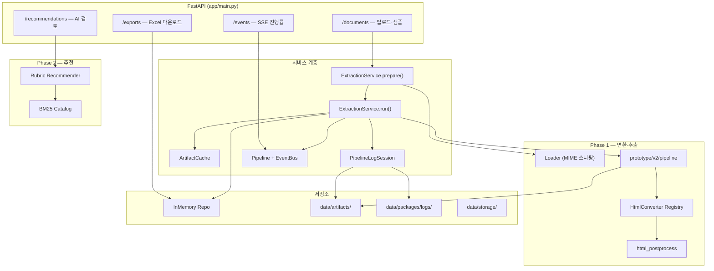
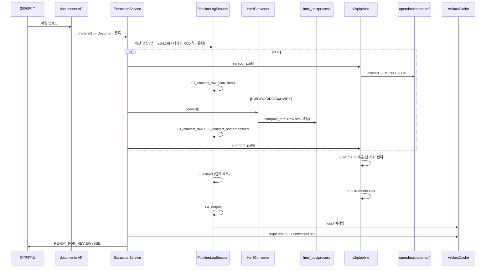
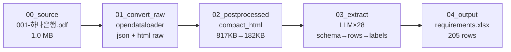
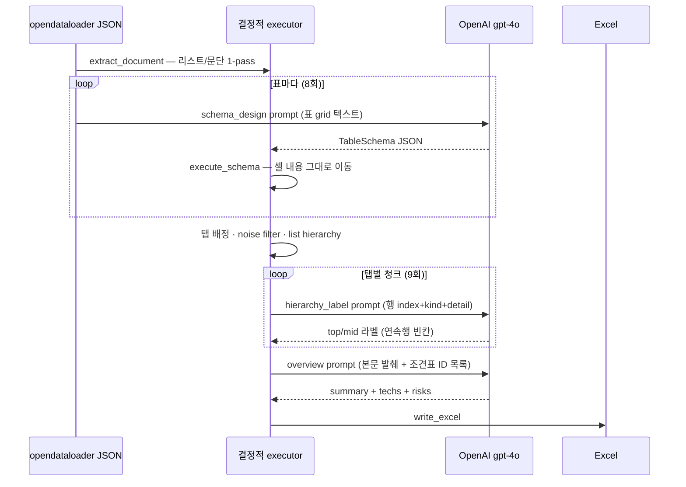

# RFP Matcher 백엔드 파이프라인

비정형 RFP(제안요청서)를 업로드하면 HTML로 변환하고, V2 추출 엔진이 요구사항 조견표 Excel을 생성한다.  
단계별 input/output은 `data/packages/logs/<run_id>/`에 항상 기록된다.

---

## 전체 구조



---

## 문서 처리 흐름 (V2 엔진, 기본)



---

## 입력 포맷별 변환기

| MIME | 확장자 | 변환기 | V2 입력 |
|------|--------|--------|---------|
| `application/pdf` | `.pdf` | opendataloader-pdf (V2 내부) | PDF 직접 |
| `application/vnd.hancom.hwpx` | `.hwpx` | HwpxConverter → 후처리 | HTML |
| `application/x-hwp` | `.hwp` | HwpConverter (hwp5html) | HTML |
| `application/vnd...wordprocessingml` | `.docx` | mammoth / LibreOffice | HTML |
| `application/msword` | `.doc` | DocViaDocx / LibreOffice | HTML |
| `text/html` | `.html` | 인코딩 감지 후 복사 | HTML |

PDF는 앱 컨버터(`pymupdf` 등)를 거치지 않고 V2가 opendataloader를 직접 호출한다.

---

## HTML 후처리 (`html_postprocess.py`)

LibreOffice·mammoth·HWPX 등이 남기는 노이즈를 제거한다.

- 제거: `style`, `font`, `span`, `meta`, `img`, header/footer div
- 보존: `table`, `rowspan`/`colspan`, `data-page`
- **항상** 후처리 전 원본을 `{파일명}.raw.html`로 백업

---

## 파이프라인 로그 디렉터리

폴더명은 **패키지 ID** (`001-하나은행`, `003-신한라이프` …) — UUID/hash 아님.

```
data/packages/logs/
├── index.json                    # 12개 패키지 요약 (rows, LLM 호출 수)
├── 001-하나은행/
│   ├── pipeline.json
│   ├── README.md
│   └── steps/
│       ├── 00_source/001-하나은행.pdf
│       ├── 01_convert_raw/001-하나은행.{json,html}   ← opendataloader raw
│       ├── 02_convert_postprocessed/
│       │   ├── raw.html                              ← 후처리 전 백업
│       │   └── 001-하나은행.html                     ← compact (style 제거)
│       ├── 03_extract/
│       │   └── llm/
│       │       ├── 001_schema_design/prompt.txt + response.json
│       │       ├── 019_hierarchy_label/...
│       │       └── 028_overview/...
│       └── 04_output/requirements.xlsx
└── 003-신한라이프/ ...
```

| 실행 경로 | run_id | 미러 위치 |
|-----------|--------|-----------|
| `scripts/generate_package_logs.py` | `001-하나은행` 등 package_base | — |
| 앱 업로드 | `content_hash[:16]` | `data/artifacts/<hash>/logs/` |

---

## Sequential I/O 예시 — `001-하나은행` (PDF)

실제 산출물: `data/packages/logs/001-하나은행/` (205 rows, LLM 28회)



### Step 0 — 원본

| | |
|--|--|
| **Input** | `data/packages/001-하나은행.pdf` |
| **Output** | `steps/00_source/001-하나은행.pdf` |

### Step 1 — 변환 (raw)

| | |
|--|--|
| **Input** | PDF 40페이지 |
| **Converter** | `opendataloader-pdf` |
| **Output** | `001-하나은행.json` (555 KB) — 표·리스트 sparse 구조 |
| | `001-하나은행.html` (817 KB) — `<span style="font-size:…">` 포함 |

raw HTML 발췌:

```html
<h2><span style="font-size: 24.000px; font-weight: 700;">[비정형</span>
<span style="font-size: 24.000px; font-weight: 700;">데이터</span> …</h2>
```

### Step 2 — HTML 후처리

| | |
|--|--|
| **Input** | `raw.html` (817 KB, style 유지) |
| **처리** | `compact_html` — span/font/style/img 제거 |
| **Output** | `001-하나은행.html` (182 KB) |

후처리 HTML 발췌:

```html
<h2>[비정형 데이터 플랫폼 구축 사업] 프로젝트 제안 요청서</h2>
<table><tr><th><p>작성날짜</p></th><th><p>2026 년 5 월 00 일</p></th></tr></table>
```

### Step 3 — 추출 (LLM sequential)

결정적 단계(코드)와 LLM 단계가 **순서대로** 실행된다.



#### 3a. `schema_design` — 표 스키마 (LLM in → schema out → 결정적 행 생성)

**Prompt 입력** (`llm/001_schema_design/prompt.txt`):

```
다음은 RFP 문서의 표다(섹션: 1. … > 1.4.3. 상세 요구). … 스키마만 설계 …
[표]
      c0 | c1
[행0] 요건 구분 | 상세내용
[행1] 데이터 수집 | ① 원천 시스템 연계 • 연계 방식은 …
[행2] 저장 구조 및 데이터 계층 관리 | ① 저장 구조 설계 • 원본 데이터는 …
```

**LLM 응답** (`response.json`):

```json
{
  "is_requirement": true,
  "header_rows": 1,
  "domain": "데이터 플랫폼",
  "columns": [
    {"index": 0, "role": "요구사항"},
    {"index": 1, "role": "상세요건"}
  ]
}
```

**결정적 출력** (LLM이 행을 쓰지 않음 — `execute_schema`가 원문 셀을 `Req` 행으로 이동):

```
Req(tab=프로젝트범위, top=데이터 수집, detail=① 원천 시스템 연계 • …)
Req(tab=프로젝트범위, top=저장 구조…, detail=① 저장 구조 설계 • …)
```

#### 3b. `hierarchy_label` — Excel 형식 계위 라벨

**Prompt 입력** (`llm/019_hierarchy_label/prompt.txt`):

```
RFP 조견표 탭 '제안개요' … 정답 Excel 형식으로 항목명·요구사항 라벨 …
[68] kind=bullet top=- mid=- | - 회사연혁, 자본금, 조직 및 인원현황
[69] kind=bullet top=- mid=- | - 주요 사업내역 및 서비스 분야
…
```

**LLM 응답**:

```json
{
  "labels": [
    {"index": 68, "top": "제안업체 정보", "mid": "회사 개요"},
    {"index": 69, "top": "", "mid": ""},
    {"index": 70, "top": "", "mid": ""}
  ]
}
```

연속 bullet 행은 top/mid가 `""` — Excel 병합 셀과 동일.

#### 3c. `overview` — 개요 시트

**Prompt 입력**: RFP 본문 발췌 + `[프로젝트범위_001] …` 형태 조견표 ID 목록

**LLM 응답**:

```json
{
  "summary": "본 프로젝트는 하나은행의 비정형 데이터 자산화 플랫폼 구축을 통해 …",
  "techs": [
    {"name": "Object Storage", "requirement": "S3 호환 …", "req_ids": ["지식베이스_001"]},
    {"name": "워크플로우 오케스트레이션", "requirement": "Low-code …", "req_ids": ["워크플로우_001"]}
  ],
  "risks": []
}
```

### Step 4 — 최종 산출

| | |
|--|--|
| **Output** | `steps/04_output/requirements.xlsx` — 205 rows, 탭별 시트 + 개요 |

### 패키지별 로그 현황 (`index.json`)

| package_base | rows | LLM calls | 비고 |
|--------------|------|-----------|------|
| 001-하나은행 | 205 | 28 | PDF + opendataloader |
| 003-신한라이프 | 620 | 63 | PDF |
| 005-법제처 | 632 | 0 | HWPX form 경로 (LLM 생략) |
| 010-금감원 | 314 | 0 | HWP form 경로 |
| 012-금감원 | 0 | 1 | 스캔 PDF (텍스트 거의 없음) |

---

## 아티팩트 캐시 vs 파이프라인 로그

| | `data/artifacts/<hash>/` | `data/packages/logs/<id>/` |
|--|--------------------------|----------------------------|
| 목적 | 재업로드 시 스킵·사이드바 재오픈 | 단계별 I/O 디버깅·QA |
| 포함 | requirements.json, converted.html, manifest | raw HTML, postprocessed, xlsx, pipeline.json |
| pipeline_snapshot | SSE 이벤트 히스토리 (ATOMIZING 등) | 변환·추출 단계 파일 |

기존 artifacts는 `scripts/backfill_pipeline_logs.py`로 부분 backfill 가능 (raw HTML 없음).

---

## 주요 모듈 맵

| 경로 | 역할 |
|------|------|
| `app/api/documents.py` | 업로드, 샘플, 캐시 재오픈 API |
| `app/services/extraction.py` | 파이프라인 오케스트레이션 |
| `app/services/pipeline_logger.py` | 단계별 I/O 로깅 |
| `app/services/artifact_cache.py` | content_hash 기반 디스크 캐시 |
| `app/services/pipeline.py` | EventBus 단계 publish |
| `app/phase1/converters/` | MIME별 HTML 변환 |
| `app/phase1/converters/html_postprocess.py` | HTML 정리 + raw 백업 |
| `prototype/v2/pipeline.py` | V2 추출 엔진 (opendataloader → LLM → Excel) |
| `app/phase2/recommender/` | BM25 + rubric AI 추천 |

---

## 환경 설정 (`config/.env`)

| 변수 | 기본값 | 설명 |
|------|--------|------|
| `EXTRACTION_ENGINE` | `v2` | `v2` 또는 `legacy` |
| `V2_TAB_MODE` | `ordered` | 탭 정렬: `ordered` / `cluster` |
| `PDF_CONVERTER` | `pymupdf` | legacy 경로 PDF 변환기 |
| `WORD_CONVERTER` | `auto` | mammoth → LibreOffice 폴백 |

---

## 관련 스크립트

```bash
source backend/.venv/bin/activate
export PYTHONPATH=backend

# 12개 패키지 전체 로그 생성 (권장) — run_id = 001-하나은행 형식
python scripts/generate_package_logs.py

# 패키지 xlsx 재생성 + 로그
python scripts/build_packages.py

# 기존 artifacts(hash 폴더) → logs backfill
python scripts/backfill_pipeline_logs.py

# 패키지 품질 검수
python scripts/inspect_packages.py
```
