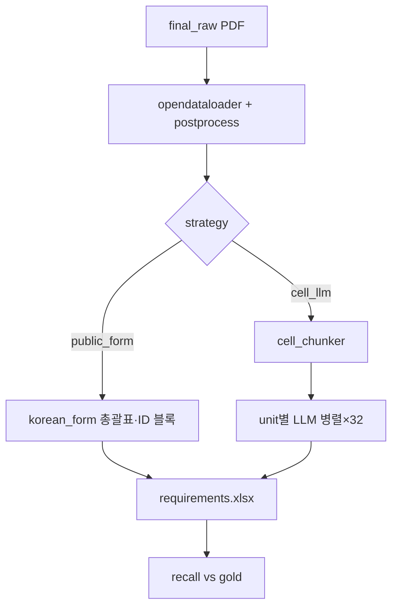

# Final 4-Sample 실험 (v3)

## 대상 (`data/final_raw/`)

| ID | 파일 | 전략 | Gold |
|----|------|------|------|
| 001-하나은행 | `하나.pdf` | **cell_llm** — 셀·bullet 단위 LLM | `domain_test/하나.xlsx` (참고) |
| 002-신한라이프 | `(신한라이프) AX HUB…pdf` | **cell_llm** | `(QA)신한라이프 AX HUB…xlsx` **목표 일치** |
| 003-법제처 | `법제처_…RFI….pdf` | **public_form** — 총괄표·form 룰 | `법제처_요구사항_정리_개선.xlsx` |
| 004-금감원 | `금감원제안요청서_24년.pdf` | **public_form** | `domain_test/금감원_24년.xlsx` |

## 산출물 (`data/artifacts_final/`)

```
artifacts_final/
├── index.json
├── 001-하나은행/
│   ├── manifest.json
│   ├── requirements.xlsx
│   ├── chunk_report.json      # unit 수, nested_table/image 탐지
│   └── logs/
│       ├── pipeline.json
│       └── steps/03_extract/llm/   # cell_unit별 prompt/response
└── …
```

## v3 파이프라인



### cell_chunker (하나·신한)

- `<li>` 1개 = 1 unit (예: `- 시스템 모니터링: Ontune`)
- 셀 안 `<ul>` 4줄 = 4 rows (예: `4.11. 산출물 관리 방안` 셀)
- **nested `<table>`** → `kind=nested_table` 기록 (`chunk_report.json`)
- **``** → `kind=image` 기록

### public_form (법제처·금감원)

- PDF HTML에서 `요구사항 총괄표` 탐지 → 탭·ID 그대로
- form 블록 pivot → 조견표 행
- nested/image는 탐지 리포트만 (본문 추출은 룰)

## 실행

```bash
source backend/.venv/bin/activate
export PYTHONPATH=backend
python scripts/run_final_batch.py   # → artifacts_final + raw 동기화
```

프론트 샘플: `data/samples.manifest.json` 4개만 노출.
