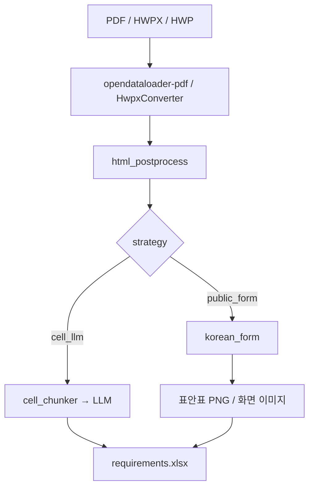

# 공공 RFP 조견표 생성

법제처·금감원 등 **한글 form 기반 공공 RFP**에서 요구사항 조견표(Excel)를 자동 생성하는 v3-final 파이프라인 정리.

---

## 1. 대상·전략

| ID | 파일 | 전략 | 설명 |
|----|------|------|------|
| 003-법제처 | `법제처_…RFI….pdf` | `public_form` | 총괄표 + form 블록 룰 추출 |
| 004-금감원 | `금감원제안요청서_24년.pdf` | `public_form` | 동일 |
| 001-하나은행 | `하나.pdf` | `table_faithful` | 표·리스트 구조 충실 추출 |
| 002-신한라이프 | `신한라이프 AX HUB….pdf` | `table_faithful` | 동일 |

FE 시연: `data/samples.manifest.json` **4종만** 노출 → `POST /documents/from-sample` → `ExtractionService._run_v3_final`.

---

## 2. 파이프라인 흐름



**핵심 모듈**

| 단계 | 파일 | 역할 |
|------|------|------|
| 변환 | `prototype/v3/convert.py` | PDF→opendataloader, HWPX 우선(페이지 절단 회피) |
| 후처리 | `app/phase1/converters/html_postprocess.py` | 스타일·빈 표·헤더/푸터 제거 |
| form 추출 | `prototype/v2/korean_form.py` | 총괄표·ID 블록·orphan 표 재결합 |
| 이미지 | `prototype/v2/table_images.py`, `image_placeholders.py` | pipe 표→PNG, 화면 캡처 복원 |
| 오케스트레이션 | `prototype/v3/pipeline_final.py` | 4종 배치·FE 연동 |

---

## 3. Pain Point ↔ 기술 대응

| Pain Point | 증상 | 대응 기술 |
|------------|------|-----------|
| **표 안의 표** | HWPX가 form 내 표를 별도 `<table>`로 분리하거나, 세부내용 셀에 인라인으로 평탄화 | `_preprocess_form_block_rows` → pipe markdown → `attach_pipe_table_images` → Excel `[표]` PNG |
| **Orphan 표** | SFR-002 에이전트 표, SFR-004 연관정보 표가 form 밖으로 떨어져 SFR-021·DAR-026에 오염, 잘못된 IPV 탭 생성 | `_is_orphan_data_table` + `_match_orphan_table_to_req` + `_attach_orphan_table` (구조 매칭, 도메인 키워드 없음) |
| **페이지 절단** | PDF opendataloader가 form 중간에서 table 분리 | `resolve_public_form_source` — 동일 stem **HWPX 우선** (법제처: `005-법제처.hwpx`) |
| **인라인 평탄 텍스트** | `분류\|수행 업무` 헤더가 한 줄 텍스트로 붙음 | `split_public_detail` / `_inline_flat_span` 전체 구간 치환, pipe 표 있으면 `atomize_detail` 스킵 |
| **이미지·화면 캡처** | FUN-012 등 UI 경로가 raw HTML ``에만 존재 | `attach_screen_images` + breadcrumb 구조 `_is_breadcrumb_footnote` |
| **부록·목차 오염** | PSR-005에 제안개요·목차 30+행 continuation | `_is_proposal_appendix_grid` + `skip_non_req_tail` |
| **IPv4/IPv6 오인** | 보안 요구 IPv4가 요구사항 ID로 인식 → IPV 탭 | `is_requirement_id`: 구분자(`-`/`_`/공백) 필수 |

---

## 4. 모듈별 처리 로직

공공 RFP(`public_form`) 파이프라인을 5단계로 나눈 처리 흐름. 각 단계는 **예시 입력 → 처리 로직 → 예시 출력** 순으로 기술한다.

```
원본(PDF/HWPX) → [1 HTML 변환] → [2 HTML 후처리] → [4 텍스트 처리] → [3 이미지 처리] → [5 조견표 생성]
```

---

### 4.1 HTML 변환 모듈

**역할** — 비정형 원본을 표·단락 구조가 보존된 HTML로 변환한다. 공공 RFP는 form 표의 rowspan/병합셀 무결성이 후속 추출의 전제다.

| 항목 | 내용 |
|------|------|
| **입력** | `법제처_RFI.pdf`, `법제처_RFI.hwpx`, `금감원제안요청서_24년.hwp` 등 |
| **출력** | `*.html` (raw), PDF인 경우 `*.json` (페이지·표·리스트 메타) |
| **변환기 선택** | PDF → opendataloader-pdf / HWPX·HWP → 전용 컨버터 |
| **공공 RFP 특수 규칙** | 동일 문서에 HWPX가 있으면 **PDF 대신 HWPX 우선** — PDF 변환 시 form 표가 페이지 경계에서 잘리는 문제 회피 |

**처리 로직**

1. 원본 확장자에 따라 변환기 선택
2. PDF: JSON+HTML 동시 생성 (표 셀 좌표·페이지 번호 보존)
3. HWPX/HWP: 한글 form `<table>` 구조 그대로 HTML 출력
4. 변환 직후 HTML 후처리 모듈로 넘김 (raw HTML은 `.raw.html`로 백업)

**예시 — 입력 (법제처 HWPX 변환 직후, raw)**

```html
<table>
  <tr><td></td></tr>                          <!-- 빈 행 -->
  <tr><td>요구사항 고유번호</td><td>SFR-002</td></tr>
  <tr><td>세부내용</td><td>◦ 에이전트 구성…</td></tr>
  <tr><td></td></tr>                          <!-- form 블록 구분 빈 행 -->
</table>
<table>                                       <!-- orphan: form 밖으로 분리된 표 -->
  <tr><td>분류</td><td>수행 업무</td></tr>
  <tr><td>의도 분석 에이전트</td><td>질의로부터 법적 쟁점을 추론…</td></tr>
</table>
```

**예시 — 출력**

```
법제처.html          (후처리 대상, ~57KB)
법제처.raw.html      (변환 원본 백업, ~520KB)
법제처.json          (PDF만, 표·리스트·page 메타)
```

---

### 4.2 HTML 후처리 모듈

**역할** — 변환기가 남기는 스타일·장식·노이즈를 제거하고, **표 구조와 본문 텍스트만** 남긴다. 추출 단계의 DOM walk 비용·오탐을 줄인다.

| 항목 | 내용 |
|------|------|
| **입력** | 변환기 raw HTML (수백 KB, inline style·font·img 다수) |
| **출력** | compact HTML (수십 KB, `<table>`·`<p>`·`rowspan`/`colspan`/`data-page`만 유지) |

**처리 로직**

1. `style` / `script` / `meta` / `link` 태그 제거
2. `font` / `span` / `b` / `i` 등 인라인 장식 태그 unwrap (텍스트만 남김)
3. `title="header"` / `title="footer"` div 제거 (LibreOffice 머리글·바닥글)
4. `` 제거 — 화면 캡처는 raw HTML + 이미지 폴더에서 별도 매칭
5. 빈 `<tr>` / `<p>` / 텍스트 없는 `<td>` 제거
6. 허용 속성만 유지: `rowspan`, `colspan`, `data-page`
7. in-place 저장 + raw 백업

**예시 — 입력 → 출력 (법제처)**

| 구분 | 내용 |
|------|------|
| 입력 크기 | 780,183 bytes → **57,500 bytes** (약 93% 감소) |
| 입력 | `<tr><td></td></tr>` 빈 행 多, `<span style="font-size:10pt">` 래핑 |
| 출력 | 빈 행 제거, form 표 연속 블록 유지, orphan 표는 그대로 보존 |

```html
<!-- 출력 (compact) -->
<table>
  <tr><td>요구사항 고유번호</td><td>SFR-002</td></tr>
  <tr><td>세부내용</td><td>◦ 검색을 위한 AI 에이전트…</td></tr>
</table>
<table>
  <tr><td>분류</td><td>수행 업무</td></tr>
  <tr><td>의도 분석 에이전트</td><td>질의로부터…</td></tr>
</table>
```

---

### 4.3 이미지 처리

**역할** — HTML 안의 **표안표**와 **UI 화면 캡처**를 조견표 Excel에 복원한다. 후처리 HTML에서는 img가 제거되므로, raw HTML·이미지 폴더·상세요건 텍스트를 교차 매칭한다.

#### A. 표안표 → PNG (pipe markdown 표)

| 항목 | 내용 |
|------|------|
| **입력** | 요구사항 `상세요건` 내 pipe markdown 표 블록 |
| **출력** | Excel `[표]` 행 + 셀 내 PNG 임베드 |

**처리 로직**

1. 상세요건에서 `| 헤더 | … |` + `|---|` 패턴 탐지
2. pipe 표를 matplotlib로 렌더 → `table_SFR-002_0.png` 캐시
3. 원문 불릿은 텍스트 행으로, 표는 별도 `[표]` 행으로 분리 (셀 병합 ID 유지)

**예시**

```
입력 (SFR-002 상세요건):
  ◦ 에이전트별 수행 업무 정의

  | 분류 | 수행 업무 |
  |---|---|
  | 의도 분석 에이전트 | 질의로부터 법적 쟁점을 추론… |
  | 검색 에이전트 | GraphRAG 기반 검색… |

출력 (Excel 2행, 동일 요구사항 ID):
  행1  상세요건: ◦ 에이전트별 수행 업무 정의
  행2  상세요건: [표]  ← PNG 임베드
```

#### B. 화면 캡처 복원 (`< 관련 화면(안) >`)

| 항목 | 내용 |
|------|------|
| **입력** | raw HTML의 `< 관련 화면(안) >` 플레이스홀더 + `*_images/` 폴더 |
| **출력** | 상세요건 끝에 화면 breadcrumb PNG 매칭 |

**처리 로직**

1. raw HTML을 문서 순서로 walk → 화면 플레이스홀더 슬롯 목록 생성
2. opendataloader 추출 이미지 중 본문 스크린샷(최소 48×48px)만 필터
3. 상세요건에 `– –` 대시 placeholder 또는 `화면(안)` 키워드가 있으면 1:1 매칭
4. `구축 예정 … 화면(안)` 등 **비요구 서술문** footnote는 제외

**예시**

```
입력 (FUN-012 세부내용, raw HTML):
  ◦ 법령 검색 결과 화면에서 조문 비교 기능 제공
  < 관련 화면(안) >
  [raw/images/page_12_img_03.png]

출력 (Excel):
  상세요건: ◦ 법령 검색 결과 화면에서 조문 비교 기능 제공
  (이미지 행) breadcrumb PNG 임베드
```

---

### 4.4 텍스트 처리

**역할** — compact HTML에서 **한글 form 구조**를 인식해 요구사항 행(Req)으로 변환한다. LLM 없이 룰베이스로 ID·명칭·정의·세부내용·산출정보를 매핑한다.

| 항목 | 내용 |
|------|------|
| **입력** | 후처리 HTML (form 표 + 총괄표 + 부록 표) |
| **출력** | `Req` 목록 — `rid`, `tab`, `top`(요구사항), `mid`(정의), `detail`(상세요건), `deliverable`, `related_req` |

**처리 로직 (순서)**

```
HTML → 표 Grid 목록
  ├─ 요구사항 총괄표 탐지 → 탭 순서(SFR/FUN/DAR/…) + 개요 시트 데이터
  ├─ form 블록 (고유번호 SFR-001 등)
  │    ├─ 세로 form pivot: 라벨행(분류/고유번호/명칭/정의/세부내용) → 필드 매핑
  │    ├─ form 내 인라인 표 → pipe markdown 병합 (DAR-009 등)
  │    └─ ◦ 불릿 단위 행 분할 (expand_detail_rows)
  ├─ orphan 표 재결합
  │    └─ form 밖 분리 표 + 세부내용 인라인 꼬리 매칭 → pipe 표 삽입
  ├─ continuation / 부록 필터
  │    └─ 제안개요·목차 표는 PSR-005 등에 붙지 않도록 tail skip
  └─ 요구사항 ID 검증 (IPv4/IPv6 오인 방지: 구분자 `-`/`_` 필수)
```

**예시 A — form 블록 → Req (SFR-001)**

```
입력 (HTML table 행):
  요구사항 고유번호 | SFR-001
  요구사항 명칭     | 에이전틱 AI 기반 질의 의도 분석 및 재구성
  정의              | 자연어 문장에서 의도를 파악하여 질의 재구성
  세부내용          | ◦ 사용자의 자연어 질문에서 법률적 맥락을…
                    ◦ 정제된 질문을 역제안하여야 함

출력 (Req 3행, Excel 셀 병합):
  rid=SFR-001  tab=SFR  요구사항=에이전틱 AI…  정의=자연어 문장에서…
  행1 detail: ◦ 사용자의 자연어 질문에서…
  행2 detail: ◦ 정제된 질문을 역제안하여야 함
```

**예시 B — orphan 표 재결합 (SFR-002)**

```
입력:
  [form] SFR-002 세부내용: ◦ 에이전트 구성…분류수행 업무의도 분석 에이전트질의로부터…  ← 평탄화 꼬리
  [orphan table]
    | 분류 | 수행 업무 |
    | 의도 분석 에이전트 | 질의로부터… |

처리:
  1) orphan 표 헤더(분류|수행 업무)가 SFR-002 detail 꼬리에 포함됨을 감지
  2) 평탄화 꼬리 제거 + pipe markdown으로 치환
  3) 이후 이미지 처리 단계에서 PNG 렌더

출력:
  rid=SFR-002  detail:
    ◦ 검색을 위한 AI 에이전트(의도 분석, 검색, …)를 구성…

    | 분류 | 수행 업무 |
    |---|---|
    | 의도 분석 에이전트 | 질의로부터… |
```

**예시 C — 총괄표 → 탭·개요**

```
입력 (요구사항 총괄표):
  | 분류 | 고유번호 | 명칭 | … |
  | SFR  | SFR-001  | …    |   |
  | FUN  | FUN-001  | …    |   |

출력:
  tab_order = [SFR, FUN, DAR, …]     ← 총괄표 등장순
  개요 시트 = 총괄표 원문 + LLM 요약·핵심기술·리스크
```

---

### 4.5 최종 조견표 생성

**역할** — `Req` 목록과 개요 데이터를 **표준 조견표 Excel**로 집계한다. 탭(시트) 순서는 총괄표·문서 등장순을 따른다.

| 항목 | 내용 |
|------|------|
| **입력** | `Req[]`, `overview`(총괄표+메타), `tab_order` |
| **출력** | `requirements.xlsx` |

**시트 구성**

| 시트 | 내용 |
|------|------|
| **요구사항 총괄표** (또는 개요) | 원문 총괄표 + 사업 요약·핵심기술·리스크 |
| **SFR / FUN / DAR / …** | 분류별 요구사항 상세 |
| **부록** | form 외 일반 표 (요구사항 아님) |

**요구사항 시트 컬럼**

| 컬럼 | 매핑 |
|------|------|
| 요구사항 ID | `rid` (SFR-001) |
| 항목명 | `tab` (SFR) |
| 요구사항 | `top` (명칭) |
| 상세요건 | `detail` (◦ 불릿 / `[표]` / 이미지) |
| 산출정보 | `deliverable` |
| 관련요구사항 | `related_req` |

**처리 로직**

1. `tab` 기준 그룹핑 → 시트 생성 (`tab_order`로 정렬)
2. 동일 `rid` 연속 행 → ID·항목명·요구사항 열 **셀 병합**
3. `detail_images` 있으면 해당 행에 PNG 삽입
4. 개요 시트: 총괄표 표 + LLM 생성 요약 블록
5. 필터·고정행·zebra 스타일 적용 후 저장

**예시 — 최종 Excel (법제처, 발췌)**

```
[시트: 요구사항 총괄표]
  분류 | 고유번호 | 명칭 | …
  SFR  | SFR-001  | 에이전틱 AI… | …
  …
  (하단) 사업 요약 / 핵심기술 5건 / 리스크

[시트: SFR]
  ID        | 항목명 | 요구사항              | 상세요건
  SFR-001   | SFR   | 에이전틱 AI…          | ◦ 사용자의 자연어…     ← 병합
            |       |                       | ◦ 정제된 질문을…
  SFR-002   | SFR   | 멀티 에이전트…        | ◦ 에이전트 구성…       ← 병합
            |       |                       | [표] ← PNG

[시트: 부록]
  (form 외 참고 표)
```

**검증 결과 (배치 기준)**

| 샘플 | 행 수 | Gold recall |
|------|-------|-------------|
| 법제처 | 383 | 96.7% |
| 금감원 | 120 | 91.5% |

---

## 5. 검증·산출물

- 법제처: SFR-004 `[표]` PNG, IPv4 오인 IPV 탭 없음
- 금감원: PSR-005 부록 bleed 제거 (1행만)
- 산출물: `data/artifacts_final/{sample_id}/requirements.xlsx`, `manifest.json`, `v3_export.pkl`

---

## 6. FE 연동

```
홈 샘플 클릭
  → GET /documents/samples (featured 4종만)
  → POST /documents/from-sample
  → ExtractionService.run()
       → resolve_final_sample(source_filename)
       → _run_v3_final (artifacts_final/v3_export.pkl 캐시 우선)
  → /review/{doc_id}
  → GET /documents/{doc_id}/export (v3_export.pkl 개요 시트)
```

**관련 파일**

- `backend/app/services/final_sample.py` — manifest 매핑
- `backend/app/services/extraction.py` — `_run_v3_final`
- `data/samples.manifest.json` — FE 4종 라벨
- `data/final.manifest.json` — strategy·gold·artifacts 경로

---

## 7. 실행

```bash
source backend/.venv/bin/activate
export PYTHONPATH=backend

# 배치 (artifacts_final 갱신 + raw 동기화)
python scripts/run_final_batch.py

# 단위 테스트
python -m pytest tests/unit/test_korean_form.py tests/unit/test_image_placeholders.py -q
```

---

## 8. 금융사 (별도 전략)

하나·신한은 `table_faithful` — 표·리스트 구조 충실 추출 (cell_llm 대체). 공공 `public_form`과 동일한 v3-final FE 경로.
